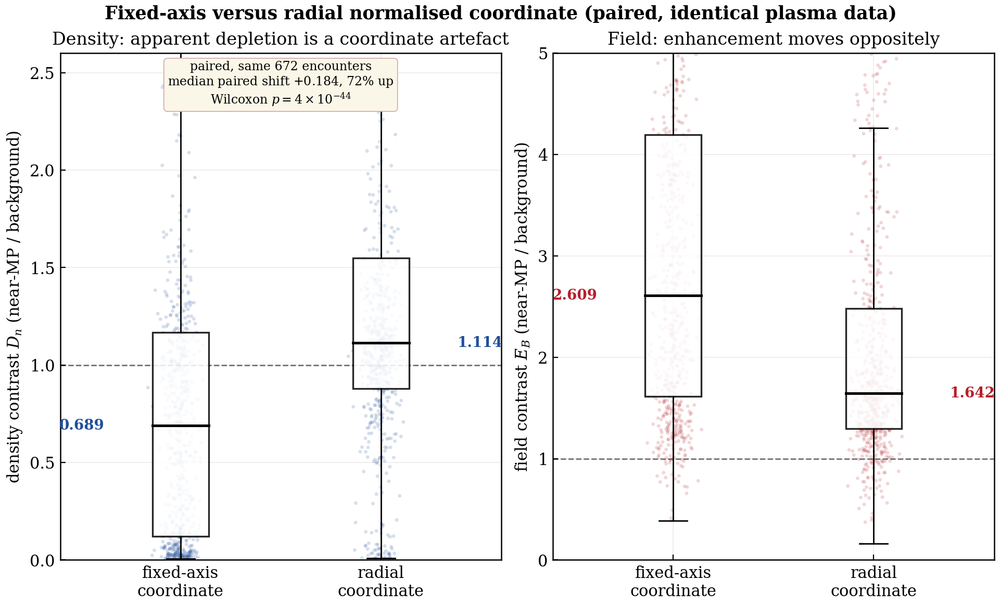

# THEMIS PDL Measurement Protocol

 [](https://doi.org/10.5281/zenodo.21198269)   

A validated measurement protocol for statistical surveys of the **dayside plasma depletion layer (PDL)** in the THEMIS magnetosheath (2007–2025): a radial normalised magnetosheath coordinate, a multi-criterion magnetosheath-membership screen, per-event ion-spectral validation, and a selection-preserving characterisation of candidate environments, with a worked demonstration of the failure modes it corrects.

Companion code to the MSc dissertation *"Coordinate construction and magnetosheath-membership screening in statistical surveys of the dayside plasma depletion layer: a THEMIS reassessment (2007–2025)"* (MSSL/UCL, 2026).

<p align="center"><br><em>The paper in one picture: the same 672 encounters, scored in two coordinate constructions that use identical boundary models and differ only in the direction along which the boundary distances are measured. The strong apparent depletion (left) is a property of the fixed-axis coordinate, not of the plasma.</em></p>

## Which door do you need?

**🔎 Door A — you are reviewing or examining the dissertation.** You want to check that the numbers and methods are real. Everything on this floor is frozen evidence:

```bash
python verify_key_numbers.py     # 22 headline numbers re-derived from committed_outputs/ in ~30 s
```

then [docs/REPRODUCING.md](docs/REPRODUCING.md) (seed the working tree, re-run any stage, diff against the committed reference) and [docs/PIPELINE_MAP.md](docs/PIPELINE_MAP.md) (which script produced which dissertation number). Every number in the dissertation traces to a file in [`committed_outputs/`](committed_outputs/).

**🛰 Door B — you want to find depletion-layer candidates in your own data.** You never need the reproduction chain:

```bash
pip install -e .
pdl-find                         # demo: 3 shipped encounters -> candidate table
pdl-find /your/encounters --csv candidates.csv
pdl-contrast --paired-check      # shell profile + population contrast + the coordinate-artefact check
```

```text
encounter             D_n    E_B   n_near    T_near      N  status
------------------------------------------------------------------
2011-12-18_the      0.526  1.998    52.97     101.8    850  candidate (moments only; no spectrum available)
2020-12-12_tha      0.554  2.279    13.48     172.6    723  spectrally supported candidate
2024-04-18_tha      0.607  2.845    19.08     123.4    781  candidate (moments only; no spectrum available)
```

Hands-on path: [docs/TUTORIAL.md](docs/TUTORIAL.md) · function reference: [docs/API.md](docs/API.md) · data schema: [docs/DATA.md](docs/DATA.md). The finder reports *candidates* (selection-limited indications), never confirmed layers; the scope note travels with the tool.

## The two principal results

1. **The coordinate artefact.** A normalised magnetosheath coordinate measured along the fixed Sun–Earth axis manufactures a strong apparent near-magnetopause depletion (broad-bin density ratio ≈ 0.69). Recomputing the *same encounters* radially (same Shue-1998 magnetopause, same Jelínek-2012 bow shock, only the measurement direction changed) removes it (≈ 1.11; paired N = 672, two-sided Wilcoxon p = 4×10⁻⁴⁴). Re-derivable from `committed_outputs/run23_paired/paired_1d_vs_radial.csv`; run the same check on your own data with `pdl-contrast --paired-check`.
2. **A weaker, boundary-sensitive surviving contrast.** Under the radial coordinate, the membership screen and per-event spectral validation: the field enhancement (E_B ≈ 1.97) is the best-measured quantity but is generic to near-boundary draping/pile-up; the population density tendency (D_n ≈ 0.92) is weak and not robust to the boundary-model placement error; **60 of 107** moment-classified candidates are *spectrally supported*: the ion energy spectra, not the moments, carry the PDL-specific inference (peak-energy ratio ≈ 1.0 for sheath-like events vs ≈ 24 for the contamination).

**And what bounds them:** no upstream driver distinguishes the candidate encounters once the candidate selection itself is replayed as a permutation null (`run30`); the one clear survivor is a quasi-perpendicular IMF preference that *strengthens* as the upstream direction steadies (+11.2° at within-window cone IQR ≤ 15°, `run31`); the dynamic-pressure ordering is degenerate with a Dp-correlated boundary-model error (`run18`) and is never claimed as a physical driver; and because the magnetopause-model placement error exceeds the classical layer thickness, the profile is read as the statistical smearing of thin near-boundary structure: a contrast **consistent with, but not diagnostic of, a PDL**, not a detection of the layer.

## Use the library directly

```python
import numpy as np
from pdl_protocol import load_encounter, member_mask, shell_contrast, find_candidates
from pdl_protocol.spectral import spectral_metrics, classify_spectrum

d = np.load("data/substrate/2020-12-12_tha.npz", allow_pickle=True)
e = load_encounter(d)                          # radial s + per-encounter background state
dn, eb = shell_contrast(e, member_mask(e), 0.05, 0.20)
print(dn, eb)                                  # -> 0.554 2.279 (the committed values)

rows = find_candidates()                       # the whole protocol over data/substrate/
```

Drop NPZ files matching the schema in [docs/DATA.md](docs/DATA.md) into `data/substrate/` (or point the tools at any directory) and every screen, contrast, spectral check and statistics script runs on them unchanged.

## Repository layout

| Path | Door | Contents |
|---|---|---|
| `src/pdl_protocol/` | B | **The installable library**: `core` (loader/screen/contrast), `coords` (Shue/Jelínek models + radial coordinate), `spectral` (metrics + classifier), `finder` (**`pdl-find`**), `contrast` (**`pdl-contrast`**), `psub` (threaded mapper), `config` (paths) |
| `examples/` | B | Five ~20-line worked examples (one encounter / spectrum / your own data / finder / contrast) |
| `tools/` | B (+A) | `get_data.py` (CDAWeb acquisition incl. the full 6,248-encounter rebuild), `seed_outputs.py` (audit seeding) |
| `docs/TUTORIAL.md`, `docs/API.md`, `docs/DATA.md` | B | Hands-on path · function reference · data acquisition + NPZ schema |
| `verify_key_numbers.py` | A | 30-second verification of every headline number (the CI gate) |
| `committed_outputs/` | A | The frozen run outputs (TXT/CSV) every dissertation number traces to — read-only by convention |
| `outputs/` *(created locally, git-ignored)* | A | Working tree where re-runs write; **diff it against `committed_outputs/` to check a reproduction** |
| `scripts/reproduce/` (+`statistics/`) | A | The dissertation chain, stages 0–18 |
| `scripts/figures/` | A | Generation scripts for all nine dissertation figures + the candidate atlas |
| `scripts/verification/` | A | Independent re-implementations and adversarial checks of the coordinate result |
| `figures/` | A | The dissertation figures as committed (pre-renumbering filenames; map below) |
| `data/substrate/`, `data/events/` | B (+A demo) | 3-encounter demo subset · re-fetched spectrogram/OMNI for the deep-dive event |
| `data/derived/` | A | The dual-geometry catalogue behind the paired headline (`run23`'s input) |
| `archive/legacy_repair/` | A | Historical scripts of the original fixed-axis→radial recompute (provenance only) |
| `docs/REPRODUCING.md`, `docs/PIPELINE_MAP.md`, `docs/SCRIPT_REFERENCE.md`, `docs/METHODS.md` | A (+B methods) | Audit path · number→script map · every script one line · methods with 14 DOI'd references |

## Figure map (repo filenames ↔ dissertation numbering)

The dissertation renumbered its figures to order of appearance late in editing; the repo keeps the original filenames so the committed outputs and scripts stay byte-consistent.

| Repo file | Dissertation figure |
|---|---|
| `fig1_geometry.png` | Figure 1 (geometry + shells) |
| `fig2_paired_artefact.png` | Figure 2 (coordinate artefact: schematic + paired result) |
| `fig3_fineshell_profile.png` | Figure 3 (radial fine-shell profile) |
| `fig7_event_archetypes.png` | Figure 4 (three event archetypes) |
| `fig5_spectral_tiers.png` | Figure 5 (spectral validation tiers) |
| `fig8_event_deepdive.png` | Figure 6 (single-event deep dive) |
| `fig9_environment.png` | Figure 7 (candidate environments vs baseline) |
| `fig6_dp_ordering.png` | Figure 8 (dynamic-pressure ordering) |
| `fig4_selection_funnel.png` | Figure 9 (selection-function cascade) |

## Key numbers to verify against `committed_outputs/`

| Quantity | Value | Source |
|---|---|---|
| Paired fixed-axis → radial D_n | 0.689 → 1.114 (N=672, p=4×10⁻⁴⁴) | `run23_paired/` |
| Selection funnel | 6,248 → 3,869 → 1,187 → 661 → 332 → 107 → 60 | `run10_selection/` |
| Population contrast (N=661) | D_n = 0.92 [0.52, 1.29], E_B = 1.97 | `run19_contrast_checks/`, `run21_contrast_stats/` |
| Spectral tiers | 60 sheath-like / 28 hot magnetospheric–boundary-layer / 4 shape / 15 borderline | `run13_validation/` |
| Threshold sensitivity | D_n 0.92 → 0.97 over density floor 0.1→2.0 cm⁻³ | `run25_threshold_sensitivity/` |
| Boundary-motion QC | median ΔMP 1.45 R_E within a window; region-swap 6%; stable after exclusion | `run27_boundary_motion_qc/` |
| Background vs solar wind | n/n_sw = 3.77, v/v_sw = 0.246; A-vs-baseline ratio excess +0.83 [+0.40, +1.18] | `run29_themis_omni_ratio/` |
| Selection null | dense-background gap INSIDE the null; cone gap exceeds it (P = 0.007–0.024) | `run30_selection_null/` |
| Stability of the cone preference | survives every leave-one-out; +11.2° at within-window cone IQR ≤ 15° (p = 0.020) | `run31_candidate_context/` |

## Terminology note (legacy labels)

Some committed outputs and scripts carry **legacy internal tier labels** (`A_SPECTRAL_CONFIRMED`, `CONFIRMED_PDL`, `HOT_BOUNDARY_FLAG`, `SHAPE_FLAG`, and funnel-stage labels such as "model-placeable") from an early pipeline stage. The dissertation's published terminology is **"spectrally supported candidates"** (60 of 107: *not* confirmed PDLs, *not* an occurrence rate) and **"hot magnetospheric / boundary-layer contaminant"**. The numerical outputs (CSVs, all statistics) are published exactly as computed. Narrative TXT headers were lightly neutralised (internal review-stage tags removed) and all text files are UTF-8; no number was altered. Two committed figures (`fig5_spectral_tiers`, `fig7_event_archetypes`) carry the legacy on-figure label "hot-boundary false positive", exactly as published in the dissertation; read it as "hot magnetospheric / boundary-layer contaminant".

## Data sources & acknowledgements

- **THEMIS** FGM and ESA data and **OMNI** solar-wind data via NASA CDAWeb (https://cdaweb.gsfc.nasa.gov), fetched with `cdasws` (`pip install -e ".[fetch]"`).
- Only a 3-encounter processed demo subset ships with the repo; the full substrate is rebuilt from the public archive (`tools/get_data.py`).
- THEMIS mission data courtesy of NASA and the THEMIS instrument teams (FGM, ESA); OMNI data from NASA/GSFC SPDF; both accessed via CDAWeb.

## Releases & DOI

Every GitHub release is archived on [Zenodo](https://zenodo.org). To cite the software in general, use the concept DOI **[10.5281/zenodo.21198269](https://doi.org/10.5281/zenodo.21198269)** (always resolves to the latest version). The current release [v1.2.0](https://github.com/Wire-Wire/themis-pdl-protocol/releases/tag/v1.2.0) is archived as [10.5281/zenodo.21198270](https://doi.org/10.5281/zenodo.21198270).

## Cite

See [`CITATION.cff`](CITATION.cff), and cite both the software and the dissertation:

> *Coordinate construction and magnetosheath-membership screening in statistical surveys of the dayside plasma depletion layer: a THEMIS reassessment (2007–2025)*, MSc dissertation, Mullard Space Science Laboratory, University College London, 2026.

## Questions

Open a GitHub issue. For "which script produces which number", see [docs/PIPELINE_MAP.md](docs/PIPELINE_MAP.md); for "what does this function do", see [docs/API.md](docs/API.md). Changes: [CHANGELOG.md](CHANGELOG.md). License: MIT (code); NASA data terms apply to the spacecraft data.
